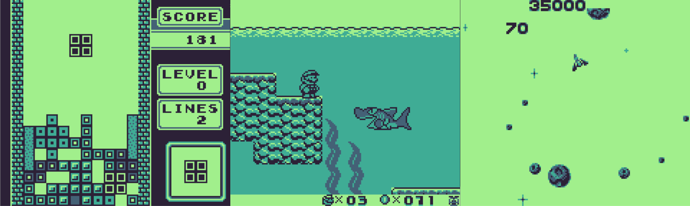

# GB Emulator
Game Boy emulator written in C.



### Libraries used:
- [SDL](https://www.libsdl.org/) - Displaying window and graphics
- [Catch2](https://github.com/catchorg/Catch2) - Unit testing

### Main features:
- Supports the following cartridge types: ROM ONLY, MBC1, MBC1+RAM, MBC1+RAM+BATTERY, MBC2, MBC2+BATTERY.
- Automatic game saves (generates *_save.sg files).
- All CPU instructions are implemented, it even passes some Blargg's tests.
- CPU Halt bug emulation.
- GPU displays tile maps, sprites and does palette swapping.
- Cartridge RAM emulation for MBC1 and MBC2 cartridges.

### Usage
You can either drag and drop a ROM file on the executable, or run it through the command line with a command like:
```
.\GB_Emulator.exe \path\to\ROM
```

### Controls
| GameBoy button  | Keyboard   |
| --------------- | ---------- |
| A               | A          |
| B               | S          |
| Start           | Return     |
| Select          | Backspace  |
| Up              | Up         |
| Down            | Down       |
| Left            | Left       |
| Right           | Right      |

Additionally, you can press ESC to close the emulator.
